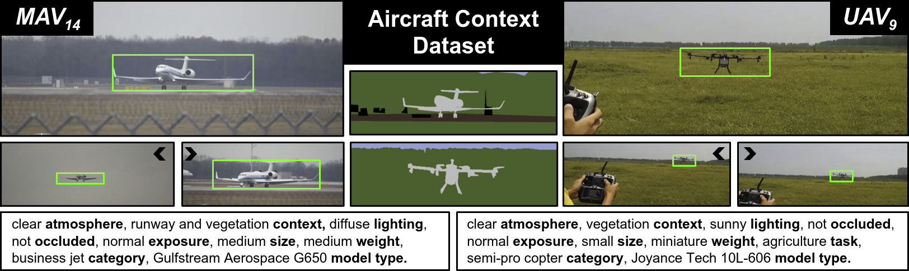
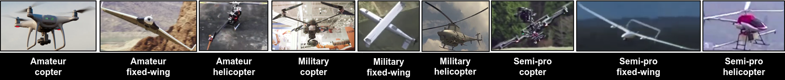
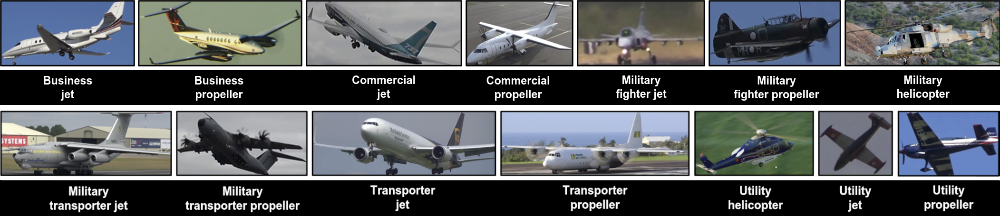

# Aircraft Context Dataset


This repository provides annotations for the Aircraft Context Dataset, which focuses on training and evaluating classification, detection and segmentation in aerial domains. 
A thorough description can be found in the corresponding [paper](https://openaccess.thecvf.com/content/ICCV2021W/AOTW/papers/Steininger_The_Aircraft_Context_Dataset_Understanding_and_Optimizing_Data_Variability_in_ICCVW_2021_paper.pdf) and [supplementary material](https://openaccess.thecvf.com/content/ICCV2021W/AOTW/supplemental/Steininger_The_Aircraft_Context_ICCVW_2021_supplemental.pdf). 
The image data corresponding to the annotations must be downloaded and extracted from the original sources using the provided scripts. The required link list can be requested by [email](mailto:daniel.steininger@ait.ac.at) (please provide your full name, affiliation and intended use of the dataset).  


## Setup
After receiving the link list described above, it can be used as an input to the script [setup_dataset.py](setup_dataset.py) to automatically download the videos and extract all annotated frames for either subset. Additionally, [visualize_annotations.py](visualize_annotations.py) is provided to visualize bounding boxes and semantic masks for all data samples.  


## Format
All annotations are provided in the following format:

* bboxes: one csv file per frame with object instances defined as *[left, top, right, bottom, objectId]*
* params: per-image meta annotations for parameters described in section 3.2 of the paper *[airborne, atmosphere, context1, context2, degredation, lighting, occluded, overexposure, underexposure, size, weight, [task1, task2, task3,] domain, propulsion, model]*.
* labelIds: semantic masks

The label specifications for classification, detection and segmentation are defined in [datasets.py](datasets.py).


## UAV 


This subset currently consists of roughly 11k annotated frames and 2k semantic masks.


## MAV


This subset will be released in Dezember 2021.


## Licence
The Aircraft Context Dataset is released to academic and non-academic entities for non-commercial purposes such as academic research, teaching, scientific publications or personal experimentation ([LICENCE](LICENCE)).


## Citing
If you use the dataset for your research, please use the following BibTeX entry:

```BibTeX
@InProceedings{Steininger2021AircraftContextDataset,
    author    = {Steininger, Daniel and Widhalm, Verena and Simon, Julia and Kriegler, Andreas and Sulzbachner, Christoph},
    title     = {The Aircraft Context Dataset: Understanding and Optimizing Data Variability in Aerial Domains},
    booktitle = {Proceedings of the IEEE/CVF International Conference on Computer Vision (ICCV) Workshops},
    month     = {October},
    year      = {2021},
    pages     = {3823-3832}
}
```
